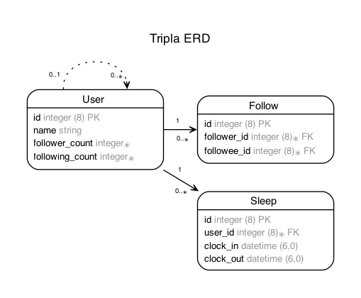
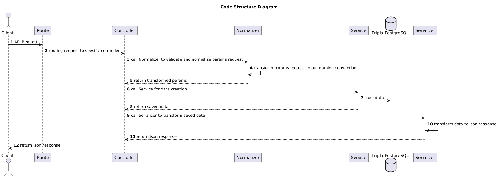

# Project Sleep Tracker

This is a simple project that allows users to:
- Login and authenticated using JWT.  
- Follow and unfollow other users.  
- Track their sleep records (clock-in & clock-out).  
- View the sleep records of people they follow.  

## **Tech Stack**
- **Backend:** Ruby on Rails  
- **Authentication:** JWT  
- **Database:** PostgreSQL (via Docker Compose)  
- **Testing:** RSpec & FactoryBot  

## **Setup Instructions**

### **1. Clone the Repository**
```bash
git clone <repository-url>
cd tripla_project
```

### **2. Run Docker (PostgreSQL)**
```bash
docker-compose up -d
```

### **3. Install Dependencies**
```bash
bundle install
```

### **4. Setup Database**
```bash
cp env.sample .env
rails db:drop # ONLY if necessary
rails db:create
rails db:migrate
rails db:seed
rails erd # if you want to re-generate an Entity-Relationship Diagram (ERD)
```

### **5. Start the Rails Server**
```bash
rails s
```

Now, open **http://localhost:3000** in your browser to access the project.

---

## **Docker Compose for PostgreSQL**
The project uses Docker Compose to run PostgreSQL.

### **`docker-compose.yml`**
```yaml
version: '3.8'
services:
  db:
    image: postgres:15
    container_name: tripla_postgres
    environment:
      POSTGRES_USER: postgres
      POSTGRES_PASSWORD: password
      POSTGRES_DB: tripla_db
    ports:
      - "5432:5432"
    volumes:
      - postgres_data:/var/lib/postgresql/data

volumes:
  postgres_data:
```

---

## **API Routes & Usage**  

### **Authentication**
#### **User Login (JWT)**
```http
POST /auth/login
```
**Request Body:**  
```json
{
  "name": "Alice"
}
```
**Response:**  
```json
{
  "data": { "token": "your.jwt.token" }
}
```


#### **Get Current User**
```http
GET /auth/me
```
**Headers:**  
```http
Authorization: Bearer your.jwt.token
```
---

### **User Actions**  
#### **Get All Users**
```http
GET /users
```

#### **Get Specific User**
```http
GET /users/:id
```

#### **Follow a User**
```http
POST /users/:id/follow
```
**Response:**  
```json
{ "message": "You are now following Bob" }
```

#### **Unfollow a User**
```http
DELETE /users/:id/unfollow
```
**Response:**  
```json
{ "message": "You have unfollowed Bob" }
```

#### **View Sleep Records of Followed Users**
```http
GET /users/following_sleep_records
```
**Response:**  
```json
[
  {
    "id": 2,
    "clock_in": "2024-02-10T22:00:00Z",
    "clock_out": "2024-02-11T06:00:00Z",
    "duration": 28800,
    "user": {
        "name": "Charlie",
        "follower_count": 2,
        "following_count": 1,
        "created_at": "2025-02-10T14:47:17.211Z",
        "updated_at": "2025-02-10T14:47:17.211Z"
    }
  }
]
```

### **Sleep Tracking**  
#### **Clock-In (Start Sleep)**
```http
POST /users/clock_in
```
**Response:**  
```json
{
    "id": 7,
    "clock_in": "2025-02-10T16:39:50.836Z",
    "clock_out": null,
    "duration": 0,
    "user": {
        "name": "Alice",
        "follower_count": 1,
        "following_count": 2,
        "created_at": "2025-02-10T14:47:17.179Z",
        "updated_at": "2025-02-10T14:47:17.179Z"
    }
}
```

#### **Clock-Out (End Sleep)**
```http
POST /users/clock_out
```
**Response:**  
```json
{
  "id": 1,
  "clock_in": "2024-02-10T22:00:00Z",
  "clock_out": "2024-02-11T06:00:00Z"
}
```

#### **View All Sleep Records**
```http
GET /users/clocked_in_times
```

---

## **Project Structure**  
- `app/controllers/auth_controller.rb` → Handles user authentication (login, JWT).  
- `app/controllers/users_controller.rb` → Handles user actions (follow/unfollow, sleep tracking).  
- `app/models/user.rb` → Defines user model & relationships.  
- `app/models/follow.rb` → Defines follow model (self-referential association).  
- `app/models/sleep.rb` → Defines sleep tracking model.  
- `app/serializers/user_serializer.rb` → Formats user JSON response.  
- `app/serializers/sleep_serializer.rb` → Formats sleep JSON response.  
- `config/routes.rb` → Defines API endpoints. 

---

## **Testing with RSpec**  
Run all tests:  
```bash
rspec
```

Run model tests:  
```bash
rspec spec/models
```

Run API request tests:  
```bash
rspec spec/requests
```

### **Factories (`spec/factories/`)**  
```ruby
FactoryBot.define do
  factory :user do
    name { Faker::Name.unique.name }
  end
end
```

```ruby
FactoryBot.define do
  factory :sleep do
    association :user
    clock_in { Time.current }
    clock_out { nil }
  end
end
```

---

## ERD


---

## **Sample Data (DB Seeds)**
The following sample users are added when you run `rails db:seed`:
```ruby
User.create(name: "Alice")
User.create(name: "Bob")
User.create(name: "Charlie")
User.create(name: "David")
User.create(name: "Eve")
```

---

## **Postman Collection**
You can import the Postman collection using the following link: [Postman Collection](./docs/Tripla.postman_collection.json)

---

## **Notes**
- This is a simple version of the project.
- Ideally, the project structure would include:
  - **Normalizer**: To validate requests in the controller.
  - **Service Interface**: To encapsulate business logic.
  - **Serializer**: To format JSON responses properly.

### Ideal Code Structure Diagram



